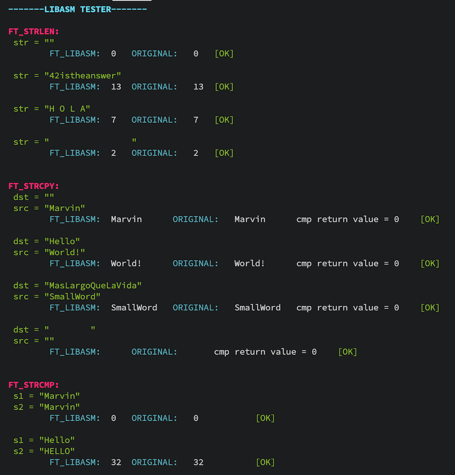

42 Madrid School assembler project for x86-64 macOS computers using Intel syntax.
Includes the spring update on the subject with appropriate management of the errno value and error messages

## How to use it

Compile with ``make`` will create the ``libasm.a`` binary.

## Available functions
```
size_t 		ft_strlen(const char *str)
char		*ft_strcpy(char *dest, const char *src)
int			ft_strcmp(const char *s1,const char *s2)
ssize_t		ft_write(int fd, const void *buf, size_t count)
ssize_t		ft_read(int fd, void *buf, size_t count)
char		*ft_strdup(const char *s)
```
## Tester
It includes an easy-to-edit ``main.c`` file to test the functions with a wide amount of predefined cases.
Compile with the library using ``gcc -Wall -Wextra -Werror main.c libasm.a`` and run the executable.
<br/><br/>

